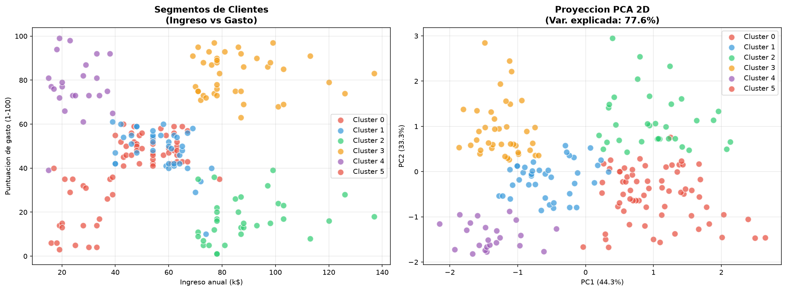
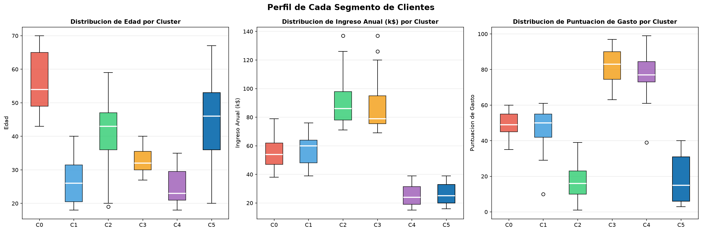
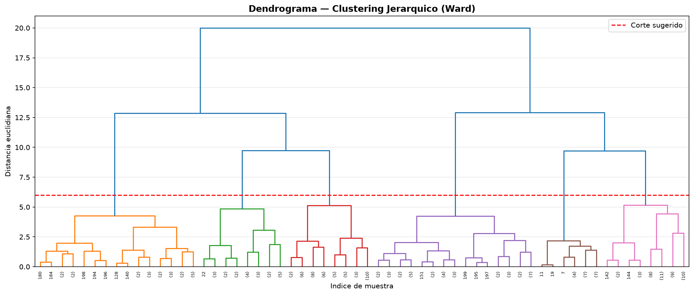
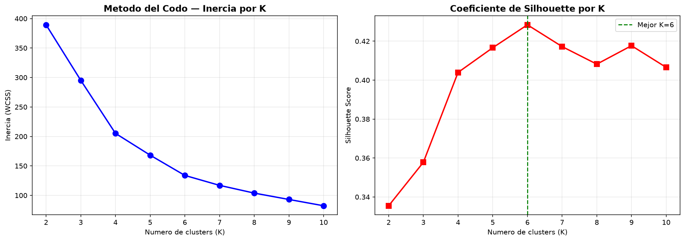

# Customer Segmentation — Clustering Analysis + Streamlit Dashboard


## Descripcion

Segmentacion de clientes de un centro comercial usando tres algoritmos de clustering.
El proyecto incluye un dashboard narrativo con Streamlit que cuenta la historia completa
del analisis: desde la exploracion hasta la interpretacion de segmentos.

## Algoritmos implementados

| Algoritmo | Tipo |
|---|---|
| K-Means | Particionamiento centroide |
| DBSCAN | Basado en densidad |
| Agglomerative Clustering | Jerarquico aglomerativo |

## Resultados

| Algoritmo | Clusters | Silhouette | Davies-Bouldin | Calinski-Harabasz |
|---|---|---|---|---|
| **DBSCAN** | 6 | **0.5190** | **0.7796** | **175.36** |
| K-Means | 6 | 0.4284 | 0.8254 | 135.10 |
| Jerarquico | 6 | 0.4201 | 0.8521 | 127.99 |

**Mejor algoritmo: DBSCAN** — supera a los demas en las tres metricas de evaluacion.
El K optimo determinado por el coeficiente de Silhouette fue **K=6**.

## Analisis y Conclusiones

**Metodo del codo y Silhouette:** El coeficiente de Silhouette confirma K=6 como numero optimo
de clusters, con un score de 0.4284 para K-Means. El metodo del codo muestra el punto de
inflexion entre K=5 y K=6.

**Segmentos identificados (6 clusters):**
- **Cluster 0 — Maduros moderados:** edad avanzada (~54 años), ingreso y gasto promedio (~50)
- **Cluster 1 — Jovenes moderados:** edad baja (~26 años), ingreso medio, gasto moderado (~50)
- **Cluster 2 — Alto ingreso, bajo gasto:** ingresos altos (~85k$), gasto muy bajo (~15) — ahorradores
- **Cluster 3 — Alto ingreso, alto gasto:** ingresos altos (~85k$), gasto muy alto (~82) — segmento premium
- **Cluster 4 — Jovenes impulsivos:** edad baja (~25 años), ingreso bajo (~25k$), gasto alto (~80)
- **Cluster 5 — Maduros conservadores:** edad alta (~45 años), ingreso bajo (~25k$), gasto bajo (~15)

**Proyeccion PCA:** Los dos primeros componentes explican el 77.6% de la varianza total,
confirmando que la estructura de 6 grupos es capturada eficientemente en 2 dimensiones.

**Dendrograma:** El clustering jerarquico con metodo Ward y corte a distancia 6 reproduce
los mismos 6 grupos, validando la consistencia de la segmentacion entre algoritmos.

### Segmentos identificados


### Perfiles por segmento


### Dendrograma jerarquico


### Metodo del codo y Silhouette


## Dashboard narrativo

El dashboard cuenta la historia del analisis en 7 capitulos:
1. El problema de negocio
2. Exploracion de datos (EDA)
3. Determinacion del K optimo
4. Resultados del clustering
5. Perfil de cada segmento
6. Interpretacion de negocio
7. Comparacion de algoritmos

```bash
cd src
streamlit run dashboard.py
```

## Estructura

```
customer-segmentation-clustering/
├── src/
│   ├── main.py
│   ├── data_loader.py
│   ├── preprocessing.py
│   ├── models.py
│   ├── evaluate.py
│   └── dashboard.py
├── data/
├── outputs/
├── models/
└── notebooks/
```

## Reproducir

```bash
git clone https://github.com/eider043/customer-segmentation-clustering.git
cd customer-segmentation-clustering
pip install -r requirements.txt
cd src
python main.py
streamlit run dashboard.py
```

## Streamlit

Link: https://customer-segmentation-clustering-d9m3stppjizhmexpftk3ul.streamlit.app/

## Autor
**Eider** — Cientifico de Datos  
[](https://www.fiverr.com/eiderdatadriven)
